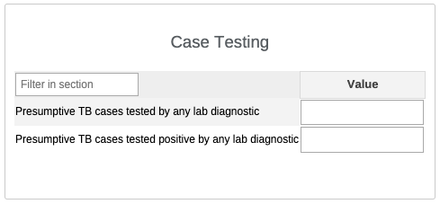
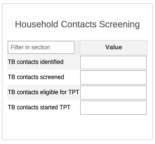
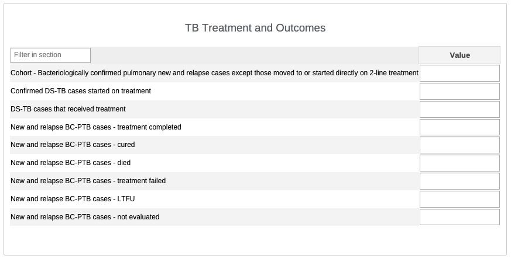
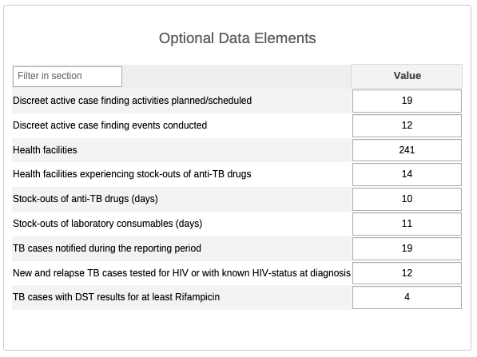
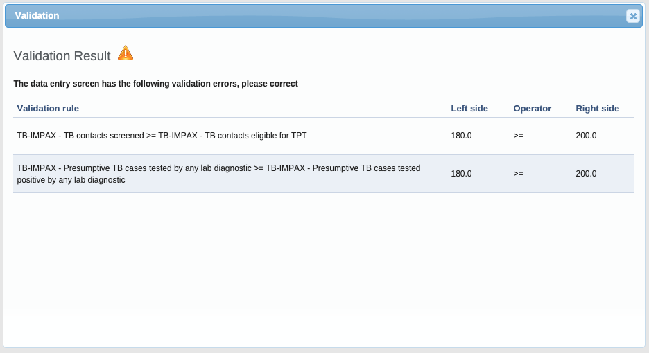

# TB/COVID-19 Impact Assessment (TB IMPAX C19 PHE) - System Design { #tb-impax-design }

## Introduction

Until the arrival of SARS-COV-2, TB was the leading cause of death from a single infectious agent worldwide. The pandemic is expected to reverse much of the progress that has been made in reducing TB-related morbidity and mortality in recent years. Disruptions such as the redistribution of TB staff to the COVID-19 response, interruptions to diagnostic networks and supply chains for TB drugs and laboratory consumables, and decreased opportunities for patient monitoring and support have been noted and are anticipated to diminish the performance of current TB services. Recent modeling of the impact of COVID-19 quarantine alone in three high burden countries suggests that as many as 6.3 million additional TB cases and 1.4 million additional deaths may result from decreased opportunities for TB detection, diagnosis and treatment.

In early 2021, a new partnership between the Robert Koch Institute (RKI), the West and Central African network for TB Research (WARN/CARN TB), the Special Programme for Research and Training in Tropical Diseases (TDR) and the Global TB Programme at WHO was established to strengthen the capacity of national TB programmes (NTPs) in West and Central Africa to monitor and mitigate the impact of COVID-19 and future PHEs on TB service provision. As a result, an impact assessment framework has been developed which outlines a common methodology to monitor and evaluate the impact of COVID-19 and future PHE on TB service provision across different epidemiological and process indicators. The framework is designed to strengthen routine TB surveillance by NTPs and to facilitate the identification and implementation of appropriate mitigation strategies to ensure the continued functionality of TB services during periods of significant disruption.

The system design document explains how the aggregate data set was configured to meet the data entry and analysis requirements and support the analysis of the aforementioned evaluation framework.

## Use Case

The aggregate TB-IMPAX C19 PHE data set was designed to overlap onto the assessment framework to identify the core activities undertaken by TB programmes and to conduct a risk assessment with hypotheses about the potential points of disruption due to COVID-19 or other future PHEs and their consequences. For each possible disruption, one or more indicators were developed to enable the measurement and monitoring of the potential impact of COVID-19.

## Intended Users

This document is intended for audiences responsible for implementing TB data systems and/or HMIS in countries, including:

- **System admins/HMIS focal points** and those responsible for installing metadata packages, designing and maintaining HMIS and/or TB data systems
- **NTB program focal points** responsible for overseeing data collection, management, analysis, and M&E activities
- **Implementation support specialists**, e.g. those providing technical assistance to the TB programme or the core HMIS unit to support & maintain DHIS2 as a national health information system and/or TB data system

## Data Sets

> **Note**
>
> To apply this framework to the COVID-19 pandemic, retrospective reporting is required starting from the beginning of the month during which the 1st diagnosed case of COVID-19 was reported in your country.

The full list of data elements and indicators is available in the package [reference file](resources/tb_impax-reference.xlsx).

### TB-IMPAX Core Data Set - Core Information

The information defined as core is the one that relates to **key TB control activities** which are routinely reported on through existing TB surveillance systems. Regular collection of core indicators can help to signal changes in TB service provision and outcomes that require further investigation in the context of a PHE or other major service disruption.

| **Data set name**       | **TB - C19 Impact Assessment - Core (monthly)** |
|---------------------|-------------------------------------------|
| **Periodicity**         | **Monthly** - Monthly collection and reporting is recommended for the core indicators. Monthly collection would be sensitive to significant change and enable timely response to an identified disruption.  If monthly collection is not feasible, quarterly collection can be considered instead. Users should consider how often the indicators are already routinely reported, compared to what would be useful or feasible for monitoring during a PHE. |
| **Level of collection** | **National and subnational** collection and reporting is recommended |
| **Disaggregation**      |  Although the data set has **no predefined disaggregation**, the should be disaggregated to highlight any differences among certain subgroups indicative of underlying inequities or challenges. At a minimum (where possible), data should be disaggregated by age and sex. |

The section collates the info on TB cases - notified, PTB, and EP-TB.

The section focuses on the 1-line laboratory diagnostics.

The section perfectly overlaps the info collected in the [HH contacts dataset](#tb-agg-hh-design) and collects the key info on cases identified, screened, eligible for TPT and receiving TPT.

The section collates the key info about the cohort, the patient with treatment and the outcome by type.

### TB-IMPAX Optional Data Set - Optional Information

Optional information **can be included or excluded in data collection efforts** based on its relevance to local context as well as the capacity of NTP staff to collect data required for the indicators. 

| **Data set name**       | **TB - C19 Impact Assessment - Optional (quarterly)** |
|---------------------|-------------------------------------------|
| **Periodicity**         | **Quarterly** - Optional indicators can be collected less frequently. For the quantitative optional indicators, a quarterly basis for collection could be considered. These recommendations should be considered in light of the PHE context (for example, bi-annual collection would be suitable for a prolonged PHE, but a shorter interval may be required for more acute PHEs) |
| **Level of collection** | **National and subnational** collection and reporting is recommended |
| **Disaggregation**      |  Although the data set has **no predefined disaggregation**, the should be disaggregated to highlight any differences among certain subgroups indicative of underlying inequities or challenges. At a minimum (where possible), data should be disaggregated by age and sex. |

The data set contains one section that can be split or edited according to the local implementation.

### Rationale for Data Set Structure

Although as per the impact assessment framework should be based on and fed via routine data regularly collected and analyzed with other DHIS2 TB aggregate data sets and tracker programs, the TB-IMPAX package was designed as an independent data set with unshared metadata.

The main reasons behind this design choice:

- **The data sets tend to be adapted locally upon implementation**. Using metadata coming from other standard TB packages would result in an increased mapping effort for the implementing countries, which had already mapped their local information and edited the standard info accordingly (data elements, category combinations, indicators, etc). This solution provides a middle ground for the mapping of locally adapted data sets without having to remap the locally defined data to the standard data.
- **The data in the system is not dependent on the uptake of certain global packages**. The use of the data elements and the analysis of the indicators is not linked to the adoption of the full aggregate/tracker package.
- **The TB-IMPAX data set can be fed by aggregate and tracker data**. Depending on how the standard packages were implemented locally, the TB-IMPAX metadata could be easier to map to a combination of routine metadata.
- **Most of the TB aggregate data is routinely collected on a quarterly basis*. The core information of the TB-IMPAX package is collected monthly. Depending on the local implementation and contextual variations applied to the standard data set, readjusting the routine data sets and their corresponding metadata might result more complex than adopting TB-IMPAX-specific metadata.

## Uptake of the Modules

The wide range of variation of the TB standard packages and metadata called for a general design of this impact assessment information to which countries and implementers could map the contextually adapted information. Depending on how the routine data was implemented and adapted, this package should be adapted keeping in mind that the main goal is keeping to the minimum any kind of additional configuration and data collection effort on top of what is already implemented and routinely collected.

Although the TB-IMPAX package includes a separate set of metadata, a [mapping guide](resources/tb_impax-mapping.xlsx) provides additional information on the alignment between TB-IMPAX data elements and indicators vs. routine TB data elements, indicators and program indicators.

The implementation of this package can thus follow different scenarios:

1. **The country is using the TB data sets and/or TB tracker as they are**.
In this case the implementation of the TB-IMPAX package can easily follow the mapping file provided and exchange the TB-IMPAX metadata with the routine TB metadata.
It is important to note though that the routine aggregate data sets, with the exception of the monthly TB-Laboratory data set, have a quarterly periodicity. Implementers and end users will have to decide whether it is easier to change the periodicity of the routine data collection, or to keep the TB-IMPAX metadata in parallel while continuing to enter the routine data with the usual periodicity. It should be noted that if the decision is to switch the frequency of routine data collection, there might be the need to enter again all the retrospective data needed for the assessment (from the beginning of the month during which the 1st COVID-19 case was reported in country)

2. **The country is using a number of standard TB data sets, or there is a hybrid tracker/aggregate implementation**.
The information coming from the standard packages can be handled as described in point 1. The information that is not routinely collected can be uptaken directly from the TB-IMPAX metadata.

3. **The routine data sets have been used as guidelines, adapted to the national guidelines, and extensively changed**.
The TB-IMPAX metadata can be directly mapped to the local metadata without having to remap it to the standard metadata first. Implementers and users should still consider the issue of the data collection frequency as highlighted in point 1.

Independently from whether the aggregate data sets have been changed locally or uptaken with their standard configuration, the mapping of the local metadata to the TB-IMPAX metadata should apply the disaggregation (Category combos) as collected routinely.

## Data Validation

The data sets include validation rules ensuring that the data entered in the system is logical and correct. The validation can be run directly in the data entry app.

The full list of the validation rules can be found in the metadata reference file.

## Dashboard

The package includes a predefined dashboard called **TB-IMPAX - C19 Impact Assessment**. The dashboard is set up using the TB-IMPAX core metadata - the optional indicators should be added locally based on the selected metadata. Depending on the uptaken solution for implementation, these should be changed/replaced or mapped to the routine metadata coming from the local/global implemented packages, or kept as such if used also for data entry.

The dashboard includes seven predefined charts presenting the information provided by the code indicators. Depending on the local implementation, additional dashboard items may be added to visualise optional indicators.

## User Groups

The module includes the same standard user groups as the TB HMIS package.

| Name | UID | Access rights |
|-----|------|---------------|
| TB access | `pyu2ZlNKbzQ` | View metadata, view data |
| TB admin  | `Ubzlyfqm1gO` | Edit and view metadata, view data |
| TB data capture | `UKWx4jJcrKt` | View metadata, capture and view data |

## References

1. <https://tdr.who.int/newsroom/news/item/08-12-2021-keeping-up-tb-care-during-public-health-emergencies>
2. [Definitions and reporting framework for tuberculosis – 2013 revision: updated December 2014 and January 2020](https://apps.who.int/iris/handle/10665/79199)
